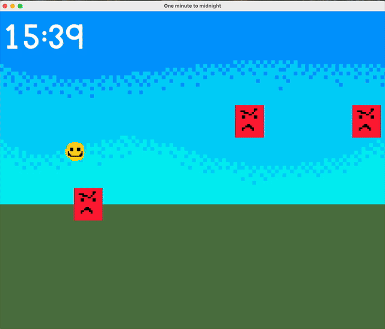

# One Minute to Midnight

A 2D action-runner: survive from midday to midnight by stomping enemies and
grabbing power-ups before the clock runs out. Built solo in ~12 hours for a
timed coding challenge (theme: "Endless Runner").

> The game-state framework and resource manager were provided as starter code.
> Everything in the gameplay layer — movement, collision, power-ups, the
> day/night cycle and the win condition — is my own work.



## How to play
- **Space** — jump. Hold Space as you land on an enemy's head to bounce higher.
- Stomp enemies from above to pop them; touching one from the side ends the run.
- Grab the **yellow power-ups** for temporary invulnerability and a speed boost.
- Survive until the clock reaches **midnight** to win. **Esc** pauses.

## What I built
- Frame-rate-independent jump physics (velocity + acceleration integration).
- Directional circle-vs-rectangle collision: stomp-from-above vs. fatal side
  hit, with a chargeable bounce.
- Timed power-up system, randomised enemy spawning, and a day/night cycle tied
  to the in-game clock that also drives the win condition.

## Building
Requires CMake ≥ 3.22 and a C++17 compiler. SFML 3.0 is fetched automatically.

```
cmake -B build
cmake --build build
```

The executable is written to `build/bin/`.
